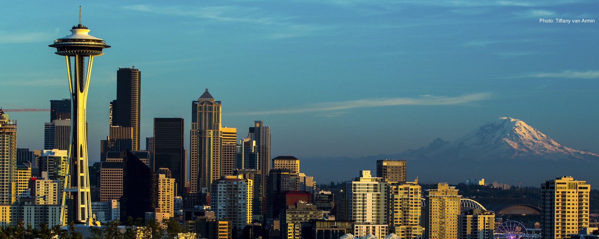
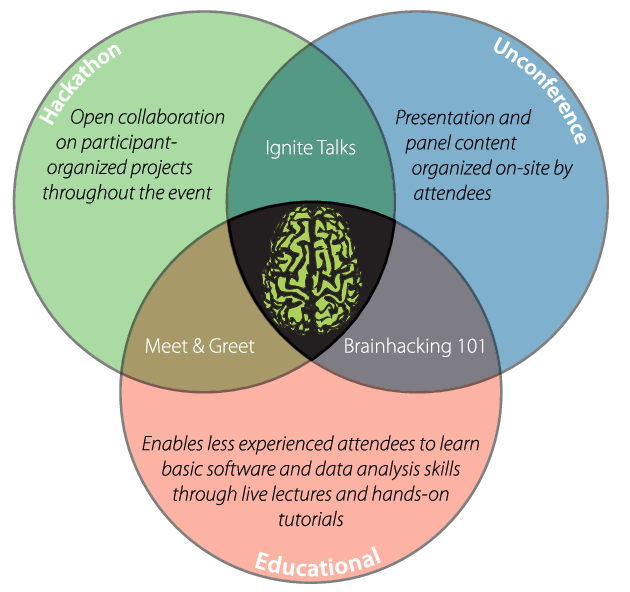
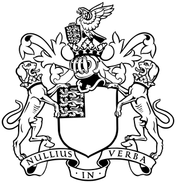
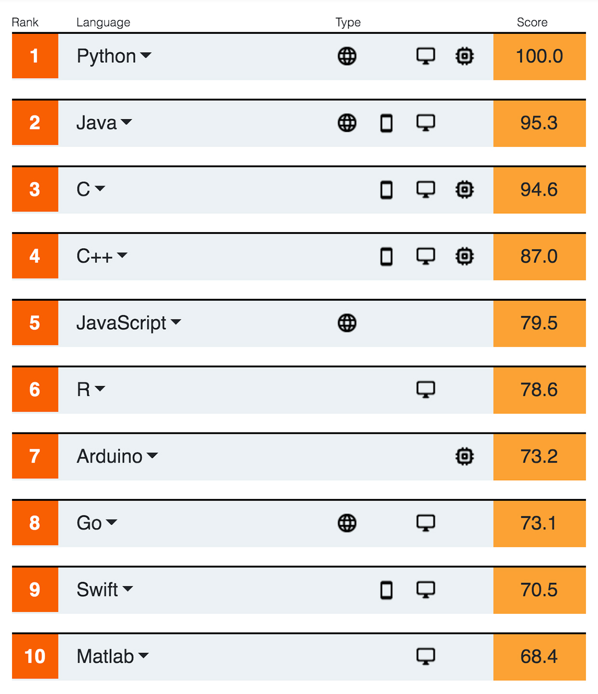
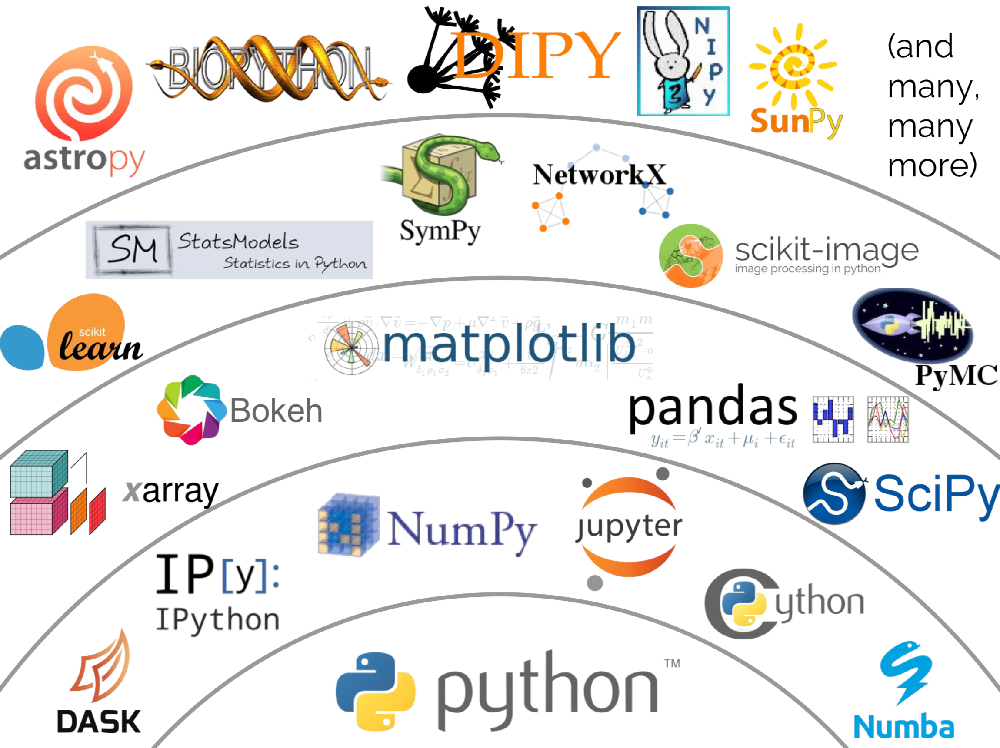
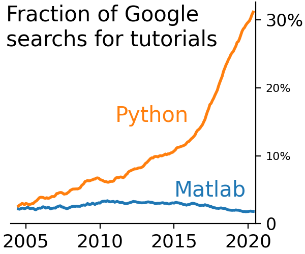
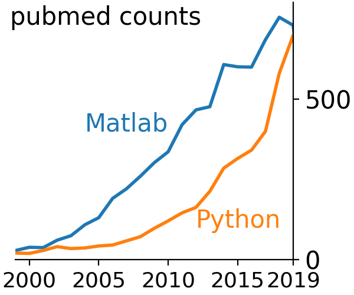
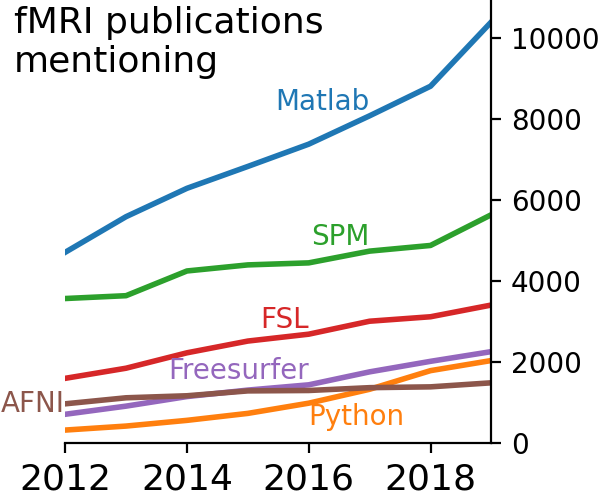
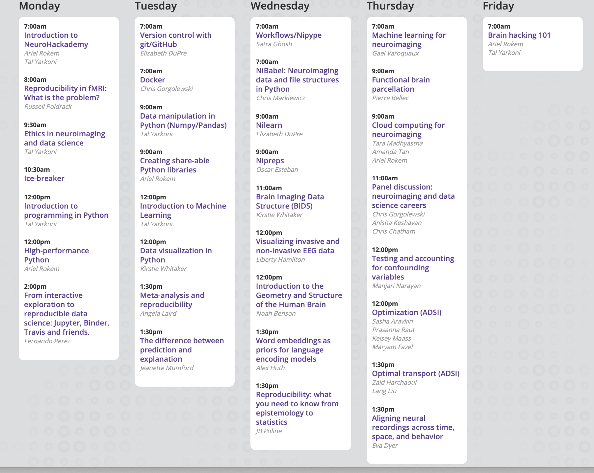

# Welcome to NeuroHackademy 2020

---

## I wish you were all here...

---
## What is NeuroHackademy?

A summer institute in neuroimaging and data science

* A summer school
* A (un)conference
* A hackathon

---
# Brainhack

---
### The hacker ethos (based on Steven Levy's, *"Hackers"*)

* The hands-on imperative
* Sharing
* Information should be free
* Mistrust authority - promote decentralization
* ~~Meritocracy~~ Inclusivity
* You can create beautiful things with computers
* Computers can change your life for the better

---

### The hacker ethos meets the reproducibility ~~crisis~~ renaissance

---

### The era of brain observatories

Large-scale open datasets

  - Data-intensive methods
  - Open-source software
  - Team science

---

### Data-intensive methods

You're going to hear a lot about machine learning (and statistics)

But also:

- Data management
- Data visualization
- Workflows

---
## Open-source software

### Python

- Neuroimaging in Python

- Scipy / Pydata

- Python in industry

---
### IEEE Spectrum PL ranking 2020

---
### Scientific python ecosystem

(From Jake Vanderplas' PyCon talk, 2017)

---
### Python in neuroimaging

(Poldrack, Gorgolewski & Varoquaux, 2019; updated in https://twitter.com/GaelVaroquaux/status/1263413593615273986)

---
### Python in neuroimaging

(Poldrack, Gorgolewski & Varoquaux, 2019; updated in https://twitter.com/GaelVaroquaux/status/1263413593615273986)

---
### Python in neuroimaging

(Poldrack, Gorgolewski & Varoquaux, 2019; updated in https://twitter.com/GaelVaroquaux/status/1263413593615273986)

---
### Team science

- Methods for collaborative software development and analysis
- Methods and considerations in sharing of research products
- A space to safely experiment with team science

---
### Wait, isn't this neuromatch academy?

- Focus on _human neuroscience_
- Focus on technical and methodological issues
- Focus on hacking

---
### Who are you?

- Some experience with neuroscience
- Some experience with programming
- Imposter syndrome disclaimer

---
### The plan

https://neurohackademy.org/neurohack_year/2020/

---

### Hackathon?

- #project-pitches channel
- Projects doc
- What makes a good project
- Convene a BOF! #bof channel

---

### Getting help

- Q&A durng each session
- Dedicated session channels
- Neurostars: https://neurostars.org/c/neurohackademy/
- Take charge! Self-organize!

---

### Jupyterhub

http://hub.neurohackademy.org

---
## This is also a social event (I hope)

- Code of conduct: https://neurohackademy.org/code-of-conduct/
- Let's get together!
- Ice-breaker today at 10:30 (Gather town)
- Jitsi
- Find your BoFs!

---
### The team

- The (fantastic) instructors
- ADSI (http://ads-institute.uw.edu/)
- Evalutator -- Jack Van Horn
- Jane Koh
- Jennifer Vo
- Erik Sundell

---
# Thank you!

