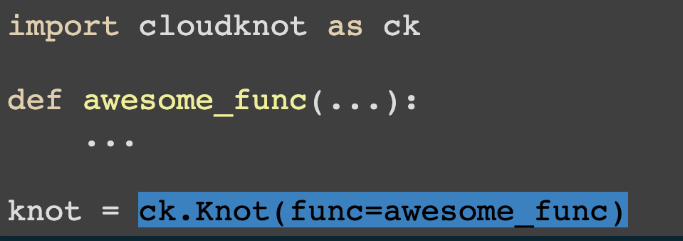
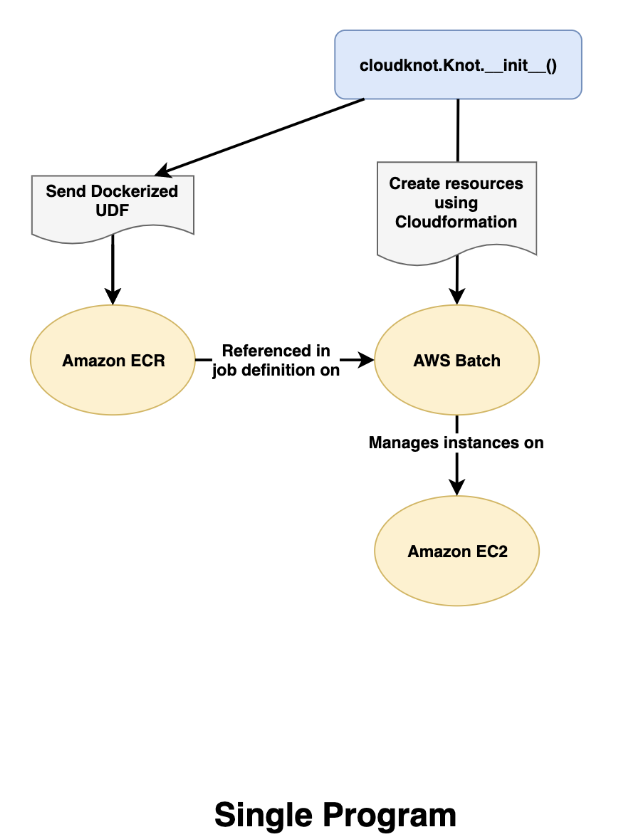
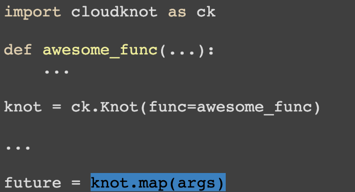
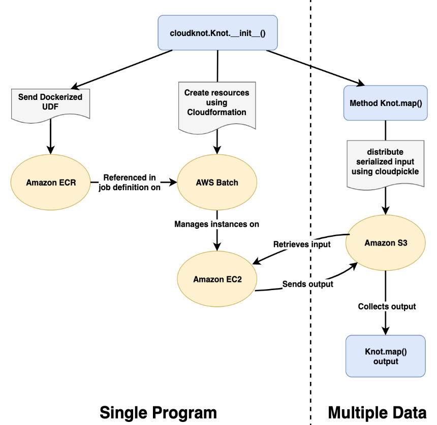

# Cloud computing for neuroimaging

---

# Sorry, what is this cloud thing again?

---

# The cloud can be a lot of different things

- You are already doing cloud computing!
- Computers you can't touch
- Computers you rent
- A set of technologies and practices
- Focus on efficiency and automation

---

# The merits of the cloud

The advantages of renting computers from a vendor

- Scalability
- Elasticity
- Frequent upgrades
- A dizzying array of services

---
# The merits of the cloud

"Cattle, not pets"

- Portability
- Verifiability
- Explicit/Declarative configuration

---

# But there are issues

- \$$$
- Complexity
- Learning curve
- "I'm a brain scientist, not a dev-ops engineer!"

---

# To the clouds!

Ultimately, we might not have a choice!

- Datasets that are too large to move (HCP: 80TB and 15 million files)
- "Bring the compute to the data" -- what does that mean?
- New kinds of hardware:
    - GPU
    - TPU
    - Quantum computing

---

# Let's look at a few things in detail

- Starting a machine in the cloud
- Reading neuroimaging data in the cloud
- Processing data in the cloud (at scale!)
- Sharing computation and analysis through Binder

---

# Processing data at scale

## Cloudknot: scaling your existing (Python) code in the (AWS) cloud

Adam Richie-Halford

---

## AWS Batch

---

# Pros:

- Abstracts away infrastructure details
- Dynamically provisions AWS resources based on requirements of user-submitted jobs
- Allows scientists to run 100,000+ batch jobs

---

# Cons

- AWS Web Console resists automation
- Requires learning new terminology
- Does not easily facilitate reproducibility

---

# AWS Batch workflow

- Build a Docker image (local machine)
- Create an Amazon ECR repository for the image (web)
- Push the build image to ECR (local machine)
- Create IAM Roles, compute environment, job queue (web)
- Create a job definition that uses the built image (web)
- Submit jobs (web)

---

# Cloudknot:

Implements Single Program Multiple Data (SPMD) parallelism

Where:

- Single program: Python function
- Multiple data: a sequence of arguments to this function

---

---

---

---

