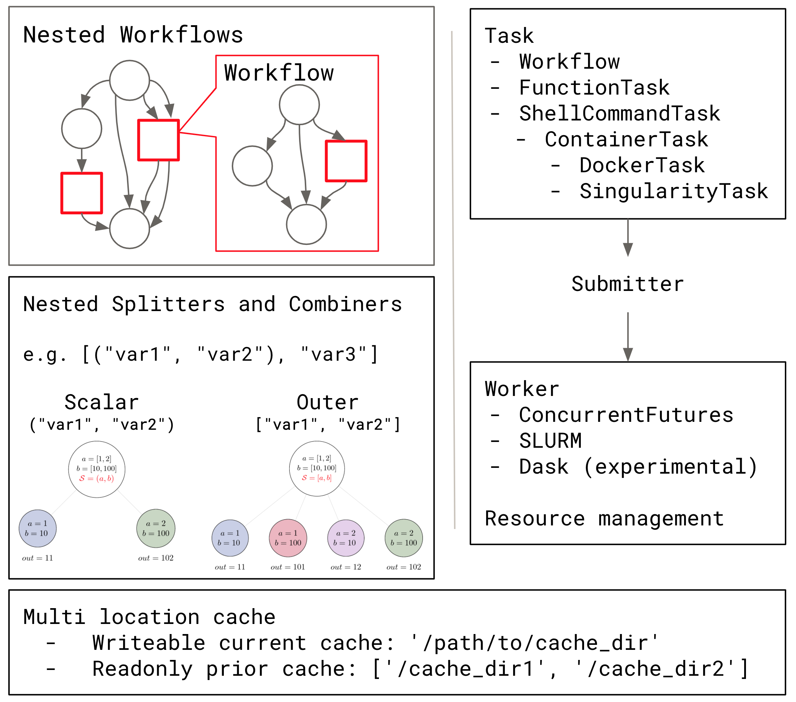

<!--
paginate: true
_paginate: false
-->

## Making Workflows Work for You!

Nipype and friends

satra@mit.edu

Questions: https://neurostars.org/

[CC-BY-4.0](https://creativecommons.org/licenses/by/4.0/)

---

# Thank you!

**People:** 190+ contributors to code, countless bug reports and questions.
**Open source projects that we depend on** 
**The Originals:** Gorgolewski, Krzysztof J.; Burns, Christopher; Ziegler, Erik; Madison, Cindee; Waskom, Michael Philipp;  Clark, Dav;  Halchenko, Yaroslav O.; Johnson, Hans; The Nipy workshop at UC Berkeley, 2009.
**Engineering core:** Esteban, Oscar;  Markiewicz, Christopher J.; Goncalves, Mathias;  Jarecka, Dorota; Notter, Michael
**Many derived packages**: CPAC, Mindboggle, Clinica, ...
**Supporting Labs:** Damian Fair, Cameron Craddock, Michael Milham, Arno Klein, Russ Poldrack, Daniel Margulies, Hans Johnson, John Gabrieli, Michael Hanke, ...

**Funding:** NIH (R24MH117295 - DANDI, R01EB020740 - Nipype, P41EB019936 - ReproNim, R03EB008673 - Nipype, R01MH081909 - Nipy, EB005149, S10RR023392, R01NS040068,UL1TR000442, ...), [INCF](https://incf.org/)

---
# Objectives of this lesson
- Why are workflow systems essential for many scientific analyses? 
- Discuss some common concepts across workflow technologies. 
- The Nipype ecosystem.
    - Some things you can do with the Nipype ecosystem.
- How you can help improve scientific workflows.
- Designing robust, reproducible, and usable workflows.
- Random pointers to several things

---
# What you will still need to learn
- Fundamentals of MRI analysis or how to analyze data in your specific neuroscientific domain. For example,
    - [Andy's brain book](https://andysbrainbook.readthedocs.io/en/latest/)
    - [NeWBI 4 fMRI](https://www.newbi4fmri.com/)
    - [ReproNim training materials](https://www.repronim.org/teach.html)
    - [Nilearn tutorials](https://nilearn.github.io/auto_examples/index.html)
- What software tools (e.g., terminal-based, script-based, Web-based, packages, libraries, workflows) exist to solve your problem
- The full potential of any of the tools we highlight here
- How to use your own laptop, HPC cluster, or the cloud to do analyses 
- How to manage your data (e.g., [Datalad](http://handbook.datalad.org/en/latest/)) and computational environment (e.g., [Neurodocker](https://github.com/ReproNim/neurodocker))

---

---

# Understand how tools behave and when they break

<h4>Use your own, or others tools, as much as you can!</h4>

In <a href="http://books.google.de/books?id=I1QEAAAAMBAJ&pg=PA62">Dr. Edward Teller's Magnificent Obsession by Robert Coughlan, in LIFE magazine (6 September 1954), p. 62</a>

---
**Workflow**, n. A set of tasks needed to achieve one or more goals.

Examples of generic workflows:
- Purchase a car
- A wedding
- Cook a meal
- Construct a house
- Fly to New Zealand

In many of these `Workflows`, a sequence of tasks has to be executed. Hence, the word `Pipeline` is often used synonymously with `Workflows`. The word `Pipeline` originates from industrial automation.

---
**Dataflow**, n. A set of tasks that consume, transform, and/or generate data towards achieving one or more goals. Specifically, tasks can get started whenever all the necessary input data is available for the task.

Examples of dataflows:
- Analyze tweets
- Build a machine learning model
- Do data wrangling and quality control 
- Run a neuroimaging analysis

In general, dataflows can be represented as computational graphs, where data flows from nodes to other nodes. 

---
# The essence of Dataflows

- **Separation:** of data, scripts, and execution.
    - Dataflows are not intricately tied to a particular data set.
- **Reuse:** Algorithms or dataflows written using such abstractions can be reused on different datasets.
- **Automation:** Dataflows do not require human intervention, allowing automated execution.
- **Standarization**: The same dataflow can be applied to similar data, which itself encourages standardization.
- **Data management**: Most dataflow frameworks rely on language abstractions to support the flow of data, often without user consideration of naming files at different stages of a dataflow.

---
# Why use Dataflows

- Most neurscience analyses comprise multiple steps that are dependent on prior steps, i.e. a graph.
    - e.g., Neuroimaging analyses may involve preprocessing, quality control, normalization, statistical inference.
<!-- So such analyses naturally constitute a dataflow -->
- Many software implement many of these of algorithms. 
    - Performance: These algorithms vary in their execution time, output quality, as a function of: 
        - sample characteristics (e.g., age, species, in vs ex vivo)
        - data quality
        - computational environment. 
    - Matchmaking: For any given application, each software brings with a set of strengths and weaknesses.

---
# So what do Dataflows enable?

- Abstraction
    - Encapsulate different functional tasks
    - Simplify the assumptions any individual task needs to consider
- Efficiency
    - Parallelization of processes
    - Reduced overhead of data management
    - Replicability
- Embed knowledge
    - Best practices
    - Heuristics
    - A structured plan for analysis (good for preregistrations)

---

# Should I always use Dataflows?

- Why are your goals/use cases?
- What are your computational dependencies?
- How are you managing the data?
- How do you parameterize the script?
- How specific is the code to one situation?
- Will you share and support your code?
- What computational resources do you have access to?

---
# Costs and benefits of Workflow systems

Workflow systems provide computational flexibility, but have a steep cost. 
- It can increase the complexity and brittleness of your environments.
- Additional learning is necessary to combine software packages.
- Cannot just point and click, need to script and program one’s analyses.
- Debugging is not always easy.

But there are benefits as well.
- You can reuse existing Workflows.
- You can combine the most appropriate algorithms for the goals (e.g., fast, accurate, precise, robust) of task rather than being restricted to what is available in a single package.
- Once you know how to construct a Dataflow, you can create others.

---
# Workflow systems

- Workflow systems: Nipype, Pydra, Snakemake, Nextflow,  ...
    - [Awesome pipelines](https://github.com/pditommaso/awesome-pipeline)
- Features to consider
    - Workflow specification language
    - Nested workflow support
    - Workflow/Task library, reusability 
    - Caching
    - Execution support: Parallelization, Managers, Containers
    - Provenance tracking
- Workflow languages: [Common Workflow Language](https://www.commonwl.org/), [Workflow Description Language](https://openwdl.org/), [Nextflow DSL](https://www.nextflow.io/docs/latest/basic.html), ...

---
# The story of Nipype
- Bring the world of neuroimaging tools together
    - What is out there?
    - How to use?
    - Which ones to use?* 
- Run analyses
    - Combine computational resources
    - Compare tools
    - Combine the "best" tools
        - Does the combination help?*

* Nipype can help answer this, but doesn't do so directly.

---
# Nipype 1.x
- Pythonic Interfaces to over 700 neuroimaging tools
    - Including support for MATLAB-based tools like SPM
- A generic workflow engine with special semantics.
- Extensive support for local and HPC workflows.
    - Local resource management across parallel tasks.
    - Remote parallel HPC distribution with monitoring.

## Nipype derivatives
[ASLPrep](https://github.com/PennLINC/aslprep) | [Clinica](https://www.clinica.run/) | [C-PAC](https://fcp-indi.github.io/) | [FitLins](https://fitlins.readthedocs.io/en/latest/) | [fMRIPrep](https://fmriprep.org/en/stable/) | [Giraffe.tools](https://giraffe.tools/) | [Halfpipe](https://github.com/HippocampusGirl/Halfpipe) | [Lyman](https://www.cns.nyu.edu/~mwaskom/software/lyman/) | [PyNets](https://pynets.readthedocs.io/en/latest/)
[Macapype](https://macatools.github.io/macapype/) | [Mindboggle](https://mindboggle.info/) | [MRIQC](https://mriqc.readthedocs.io/en/latest/) | [Neuropycon/Ephypype/Graphpype](https://neuropycon.github.io/ephypype/) | [Nipreps](https://nipreps.org/) | [QSIPrep](https://qsiprep.readthedocs.io/en/latest/) 

---
# What does Nipype do and not do?
- Nipype does not create workflows for you.
- Nipype does not optimize workflows for you.
    - It can optimize some of the execution.
- Nipype allows you to create scalable, complex workflows.
- Nipype allows you to mix and match software with the same Pythonic interface.
- To **use** Nipype workflows you need to know minimal Python and shell.
- To **create** Nipype workflows you need to know: Python, Nipype semantics, and at least 1 neuroimaging package.

---

---

## Nipype is transitioning
- Nipype 1.x is the current stable platform.
- Nipype 2.0 is a new ecosystem of tools.

---
# Nipype 2.0: An ecosystem

- [pydra](https://github.com/nipype/pydra): A general purpose workflow engine
    - [pydra-ml](https://github.com/nipype/pydra-ml): A demo application
    - [pydra-tasks](https://github.com/nipype/): Packages that provide Pydra tasks
- [neurodocker](https://github.com/ReproNim/neurodocker): A neuroscience container builder
- [testkraken](https://github.com/ReproNim/testkraken): A parametric/vibration testing framework

- [nipreps](https://www.nipreps.org/): Preprocessing workflows
- [niflows](https://github.com/niflows/): A general purpose Dataflow repository
- [nobrainer](https://github.com/neuronets): Deep learning models

---

# Pydra Features
- Composable dataflows.
- Flexible semantics for looping over input sets.
- A content-addressable global cache.
- Support for Python functions and external (shell) commands.
- Native container execution support.
- Auditing and provenance tracking. 
- [Pydra paper](https://doi.org/10.25080/Majora-342d178e-012)

---
# Tutorial Intro to Nipype and Pydra concepts

#### Neurohackademy Minimal Tutorial
[For attendees during neurohackademy](https://hub.neurohackademy.org/)

#### The Full Monty | The Whole Nine Yards - Available via myBinder.org
The Nipype tutorial:  https://miykael.github.io/nipype_tutorial
The Pydra tutorial: https://github.com/nipype/pydra-tutorial

---
# Design/Execution Tradeoffs
- How to parallelize?
    - Atomic
    - Per participant, per subworkflow
    - Database + resource driven
    - Cost driven
- Which packages to use?
    - Availability (re-executability by others)
    - Licesning 
    - Complexity of maintenance
    - Optimization goals
- How replicable do you want it to be?

---
# Q&A topics
- Designing good Dataflows
- Validating Dataflows
